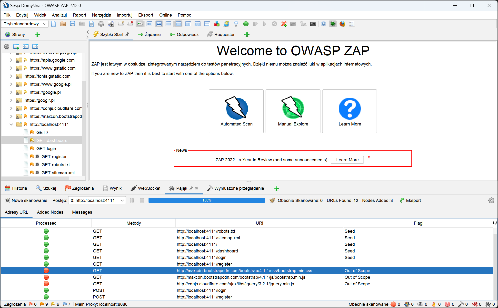
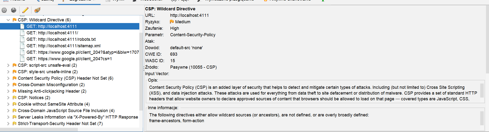
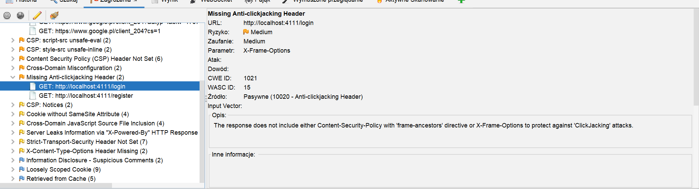
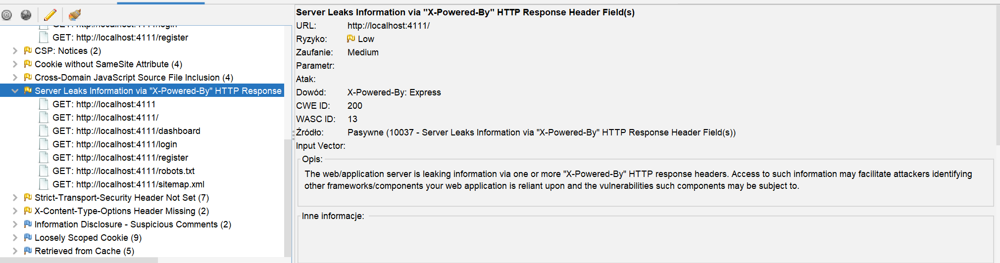

## Program synk v1.1087.0 zwrócił następująca zawartość po zastosowaniu polecenia `synk test`

```sh
Tested 89 dependencies for known issues, found 4 issues, 5 vulnerable paths.


Issues to fix by upgrading:

  Upgrade express@4.17.1 to express@4.17.3 to fix
  ✗ Prototype Poisoning [High Severity][https://security.snyk.io/vuln/SNYK-JS-QS-3153490] in qs@6.7.0
    introduced by express@4.17.1 > qs@6.7.0 and 1 other path(s)

  Upgrade mongoose@6.0.3 to mongoose@6.4.6 to fix
  ✗ Prototype Pollution [Medium Severity][https://security.snyk.io/vuln/SNYK-JS-MPATH-1577289] in mpath@0.8.3
    introduced by mongoose@6.0.3 > mpath@0.8.3
  ✗ Prototype Pollution [High Severity][https://security.snyk.io/vuln/SNYK-JS-MONGOOSE-2961688] in mongoose@6.0.3
    introduced by mongoose@6.0.3

  Upgrade passport@0.4.1 to passport@0.6.0 to fix
  ✗ Session Fixation [Medium Severity][https://security.snyk.io/vuln/SNYK-JS-PASSPORT-2840631] in passport@0.4.1
    introduced by passport@0.4.1


Organization:      gekonisko
Package manager:   npm
Target file:       package-lock.json
Project name:      Dashboard
Open source:       no
Project path:      C:\Users\Laptop-lenovo\Desktop\mvc-main
Licenses:          enabled
```

Jak mozna zauważyć aplikacja zwróciła podatności znajdujące się w wyżej wymienionych biblitekach zainstalowanych w projekcie.

## Polecenie `npm audit`

```sh
express  <=4.17.2 || 5.0.0-alpha.1 - 5.0.0-alpha.8
Severity: high
qs vulnerable to Prototype Pollution - https://github.com/advisories/GHSA-hrpp-h998-j3pp
Depends on vulnerable versions of body-parser
Depends on vulnerable versions of qs
fix available via `npm audit fix`
node_modules/express

mongoose  3.6.0-rc0 - 5.13.8 || 6.0.0-rc0 - 6.4.5
Severity: critical
automattic/mongoose vulnerable to Prototype pollution via Schema.path - https://github.com/advisories/GHSA-f825-f98c-gj3g
Depends on vulnerable versions of mpath
fix available via `npm audit fix`
node_modules/mongoose

mpath  <0.8.4
Severity: critical
Type confusion in mpath - https://github.com/advisories/GHSA-p92x-r36w-9395
fix available via `npm audit fix`
node_modules/mpath

passport  <0.6.0
Severity: moderate
Passport before 0.6.0 vulnerable to session regeneration when a users logs in or out - https://github.com/advisories/GHSA-v923-w3x8-wh69
fix available via `npm audit fix --force`
Will install passport@0.6.0, which is a breaking change
node_modules/passport

qs  6.7.0 - 6.7.2
Severity: high
qs vulnerable to Prototype Pollution - https://github.com/advisories/GHSA-hrpp-h998-j3pp
fix available via `npm audit fix`
node_modules/qs
  body-parser  1.19.0
  Depends on vulnerable versions of qs
  node_modules/body-parser

6 vulnerabilities (1 moderate, 3 high, 2 critical)

To address issues that do not require attention, run:
  npm audit fix

To address all issues (including breaking changes), run:
  npm audit fix --force
```

Npm audit również znalazło podatności a dokładnie

```
6 vulnerabilities (1 moderate, 3 high, 2 critical)
```

pokrywają się one z podatnościami znalezionymi przez aplikację zap. Mozna tutaj również zauwżyć informację o naprawie znalezionych podatności `npm audit fix`

## Naprawa

W celu naprawy zostało wydane polecenie `npm audit fix` , jednak nie podbiło ona biblioteki `passport` do passport wesji 0.6.0. Aktualizację biblioteki wykonałem ręcznie poleceniem `npm install passport@0.6.0`. Aplikacja synk przestała pokazywać informację o zagrożeniach.

## Analiza programem ZAP 2.12.0



Moduł Spider znalazł pliki które używane są w aplikacji jednak znajdują się poza nia (na innym serwrze). Akatkujący mógłby zdobyć dostep do takiego serwera a nastepnie przejąć naszą aplikacjię.

## Naprawa

Dodanie atrybutów `integrity` sprawdzających zgodność pobranego pliku z zapisanem hashem w atrybucie `integrity`. Atrybut ten wprowadza mechanizm subresource integrity (SRI) pozwala nam na uzyskanie pewności co do niezmienności ładowanych źródeł.



ZAP wykrył problem z brakiem ustawionego nagłówka CSP.
Dodałem middleware który tworzy następujący nagłówek CSP:

```
"Content-Security-Policy":"default-src 'self' 'unsafe-inline'; style-src-elem 'self' 'unsafe-inline' https://cdn.jsdelivr.net; script-src-elem 'self' 'unsafe-inline' https://cdn.jsdelivr.net; img-src 'self' https://getbootstrap.com;"
```

Ustawiony nagłówek CSP pozwala na ładowanie contentu tylko z orgina w którym załadowana została aplikacja oraz domen

- https://cdn.jsdelivr.net
- https://getbootstrap.com

z których pobierany jest bootstrap, flaga 'unsafe-inline' zezwala na uzywanie funkcji onClick w htmlu



Następny alert to brak nagłówka X-Frame-Options który blokuje wyświetlanie strony w zewnętrznych iFrameach dodałem go z flagą DENY



Alert nakazuje usunięcie informacji na temat używanego framworka, Pozwala to atakającemu zawężenia metod ataku.
Rozwiązaniem było usunięce nagłówek X-Powered-By
